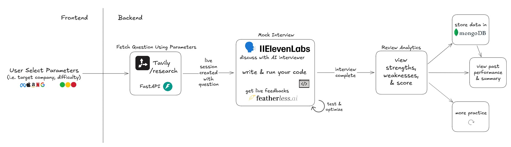
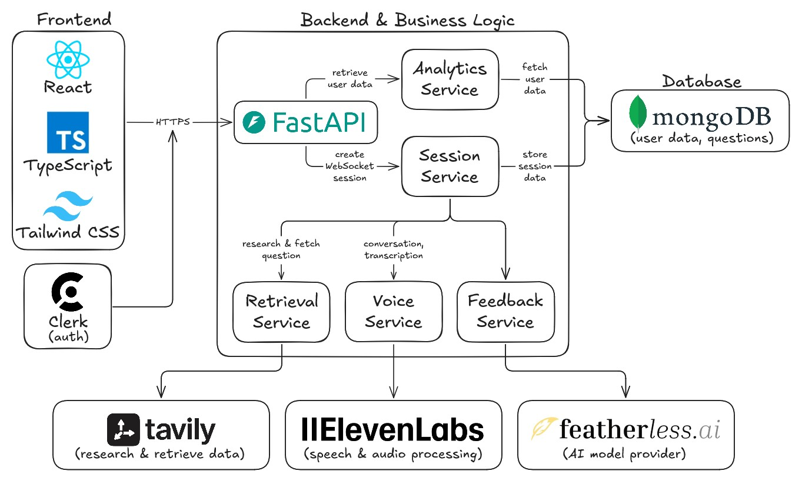

# Intervue

## Table of Contents

1. [Overview](#overview)  
2. [Inspiration](#inspiration)  
3. [How It Works](#how-it-works)
4. [Tech Stack](#tech-stack)
5. [Getting Started](#getting-started)  
   - [Prerequisites](#prerequisites)
   - [Installation](#installation)  
6. [Diagrams](#diagrams)

## Overview

**TODO "Don’t just prep. Practice for real." "Practice for interviews, not just questions."** Intervue is a live, voice-first mock interview platform that simulates the nuance and pressure of real technical and behavioral interviews. By blending real-time web intelligence with adaptive AI, we help candidates stop rehearsing and start performing.


## Inspiration
Most interview prep tools are static: you read a question on a screen and type an answer. But real interviews are **dynamic, verbal, and unpredictable**. Candidates often struggle not with *what* they know, but with *how* they communicate it under pressure.


## How It Works

1.  **Specify Your Question:** Provide the role, company, question difficulty and other relevant parameters.
2.  **Sharpen Your Skills:** Engage in up to 60 minutes of voice-to-voice interview session where you can talk about your approaches, write and run code, many other elements that real interviews would have.
3.  **The Feedback Loop:** Our engine analyzes your performance after each session, so you know exactly what needs improving and where you excel.


## Tech Stack

* **Frontend:** React, TypeScript, Tailwind CSS, Clerk
* **Backend:** FastAPI, Python, WebSocket, Judge0 (code execution)
* **Voice/AI:** ElevenLabs, Tavily, Featherless (Gemini 2.0 Flash), Groq
* **Database:** MongoDB


## Getting Started

### Prerequisites
* Python 3.10+
* API Keys for:
    - Clerk
    - ElevenLabs
    - Groq
    - Judge0
    - MongoDB
    - Tavily

### Installation
1.  **Clone the repo:**
    ```bash
    git clone https://github.com/justinyc1/hack-brooklyn-2026.git
    cd hack-brooklyn-2026
    ```
2.  **Setup Environment:**
    ```bash
    #frontend: 
    cp .env.example .env
    # open .env and replace with your API keys
    
    #backend: 
    cp .env.example .env
    # open .env and replace with your API keys
    ```
3.  **Install dependencies:**
    ```bash
    # frontend:
    cd frontend
    npm install

    # backend:
    cd backend
    python -m venv .venv
    .venv\Scripts\Activate.ps1
    pip install -r requirements.txt
    ```

5.  **Run the App:**
    ```bash
    # frontend:
    npm run dev

    # backend:
    uvicorn main:app --reload
    ```

## Diagrams
### User Flow:


### System Architecture:
